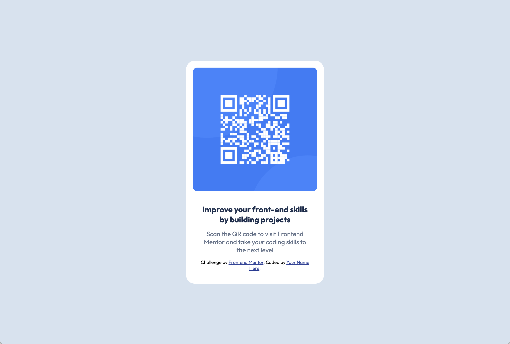

# Frontend Mentor - QR code component solution

This is a solution to the [QR code component challenge on Frontend Mentor](https://www.frontendmentor.io/challenges/qr-code-component-iux_sIO_H). Frontend Mentor challenges help you improve your coding skills by building realistic projects. 

## Table of contents

- [Overview](#overview)
  - [Screenshot](#screenshot)
  - [Links](#links)
- [My process](#my-process)
  - [Built with](#built-with)
  - [What I learned](#what-i-learned)
  - [Continued development](#continued-development)
  - [Useful resources](#useful-resources)
- [Author](#author)

## Overview

### Screenshot

### Links

- Solution URL: [Add solution URL here](https://github.com/TaurusCanis/FEM_QR_Code
- Live Site URL: [Add live site URL here](https://tauruscanis.github.io/FEM_QR_Code/)

## My process

### Built with

- Semantic HTML5 markup
- CSS custom properties
- Flexbox
- Mobile-first workflow

### What I learned

This was a good exercise for helping to reinforce the proper workflow. I tend to hack around and just do things as they come up, but working with a relatively simple assignment and having a straightforward process for how to approach it outlined was very helpful. I need to adopt that kind of process for my own projects. And I very much need to keep practicing with CSS and design. I've been using CSS for years but have never really felt like I was very good at it.

### Continued development

I definitely need to work on media queries. I struggle to decide where to put them.

### Useful resources

- [How to Center a Div](https://www.joshwcomeau.com/css/center-a-div/) - I feel like I always have to look up how to center divs. This resource has a bunch of different ways to do it.

## Author

- Website - [TaurusCanis](https://github.com/TaurusCanis)
- Frontend Mentor - [@TaurusCanis](https://www.frontendmentor.io/profile/TaurusCanis)

